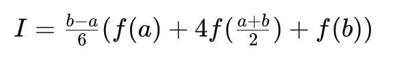
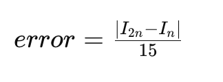

# Algorithms-and-methods-of-calculations
___
1. ***Метод Симпсона с контролем погрешности по формуле Рунге.***

Метод Симпсона - это численный метод интегрирования, который использует аппроксимацию подынтегральной функции квадратичными интерполяционными полиномами и формулу трапеций для вычисления интеграла на каждом интервале. Для контроля погрешности метода Симпсона обычно используется метод Рунге, который позволяет оценить точность вычислений.

:heavy_exclamation_mark: *Алгоритм:* 

+ Определите функцию, которую вы хотите интегрировать, и пределы интегрирования.

+ Разбейте интервал интегрирования на равные подинтервалы. Для метода Симпсона необходимо, чтобы количество подинтервалов было чётным.

+ Вычислите значения функции в узлах интегрирования. Узлы интегрирования - это концы каждого подинтервала и их середины.

+ Примените формулу Симпсона для каждого подинтервала и вычислите приближенное значение интеграла. Формула Симпсона для одного подинтервала [a, b]:

+ Сложите все приближенные значения интегралов на каждом подинтервале, чтобы получить общее приближенное значение интеграла.

+ Проверьте выполнение условия останова. Обычно используется критерий Рунге. Для этого вычислите интеграл с использованием двойного числа подинтервалов (n) и вычислите интеграл с использованием вдвое большего числа подинтервалов (2n). 

+ Вычислите оценку погрешности методом Рунге по формуле:

+ Если оценка погрешности меньше заданного порога или число итераций достигло максимального значения, завершите процесс. В противном случае увеличьте количество подинтервалов в два раза и повторите шаги с 3 по 7.

+ Верните полученное приближенное значение интеграла в качестве результата.

[Реализация метода](laboratory_work1/task1/Simpson.go)

2. ***Метод Монте-Карло***

Метод Монте-Карло - это численный метод, который использует случайные выборки для решения различных математических задач, таких как вычисление интегралов, решение уравнений и оценка вероятностей. 

:heavy_exclamation_mark: *Алгоритм:* 

+ Определите функцию, которую необходимо интегрировать, и интервалы, в которых вы хотите вычислить интеграл.

+ Определите геометрическую область, которая описывает функцию на выбранном интервале.

+ Генерируйте случайные точки внутри этой геометрической области.

+ Определите, сколько из сгенерированных точек попадает в область, описывающую функцию.

+ Вычислите отношение числа точек, попавших в область функции, к общему числу сгенерированных точек. Это отношение обычно обозначается как r.

+ Умножьте это отношение r на площадь геометрической области, чтобы получить приближенное значение интеграла функции.

+ Оцените погрешность результата. Чем больше точек было сгенерировано, тем более точным будет приближение. Один из способов оценки погрешности - использование стандартного отклонения значений, полученных из множества случайных выборок.

+ Повторите шаги с 3 по 7 необходимое количество раз, чтобы получить удовлетворительную точность или погрешность.

+ Верните полученное приближенное значение интеграла в качестве результата.